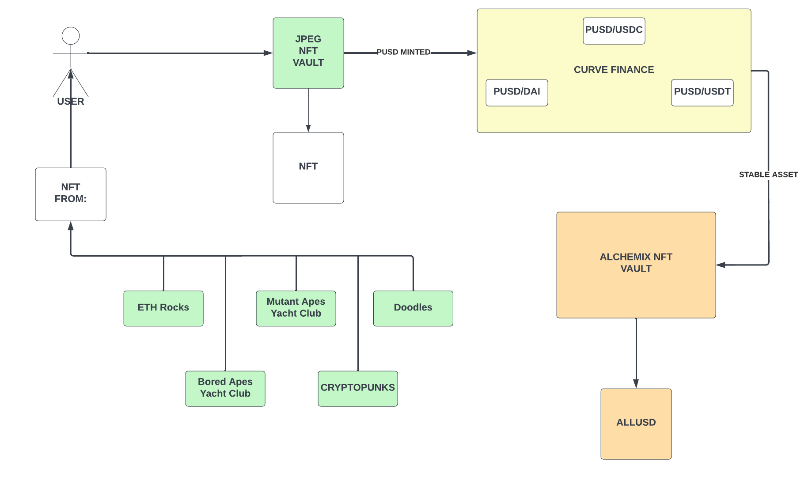
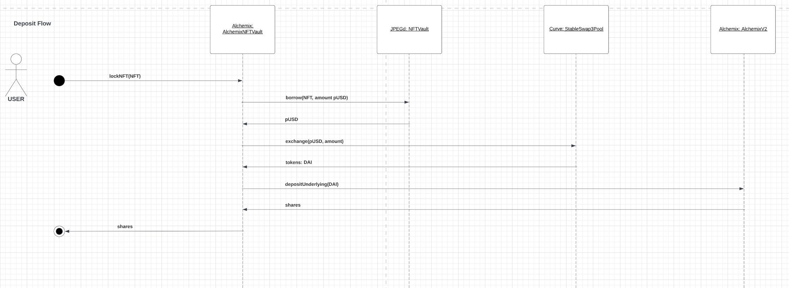
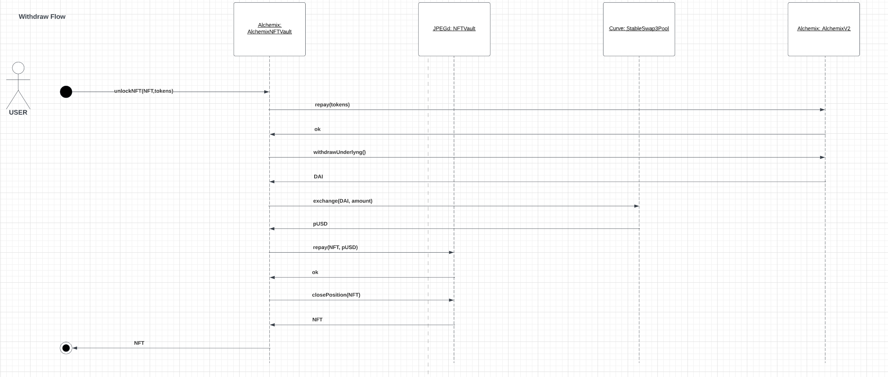

# Alchemix: Non-Fungible Tokens as Collateral
## Context

Currently, The Alchemix Platform allows users to leverage a range of ERC-20 tokens without risk of liquidation depositing those tokens in vaults.
## Proposal

Add the possibility to the users request a loan using their NFTs to be used as collateral through an integration with a loan platform for NFT. Users can leverage their idle NFTs to obtain loans and earn extra yield.

## Solution

For our solution, we analyzed two NFTs loan platform: Drops and JPEGd. Those platform work a quite different. For instance, Drops has lending pools where the user gets eth, dai or usdc. On the other hand, JPEGd offeres in exchange pUSD and a third party is required to exchange those tokens to ones that Alchemix supports. In that case, we propose Curve.fi to swap them.

The idea is to create different types of vaults on Alchemix to allow users to deposit their tokens there. For instance, JPEGd CryptoPunk NFTs. 

### JPEGd integration

* Using the JPEGd NFT borrowing and lending platform, the Protocol will create a new vault asking the user to transfer its NFT. Nowadays, this platform has four different types of NFT collections.  Such as CryptoPunks, BAYC, MAYC, Doodles and EtherRocks. 
* Firstly, the users deposits a NFT in the corresponding vault 
* Secondly, behind the scene those tokens will be deposited into JPEGd in exchange of pUSD which will be minted. 
* Thirdly, The pUSD tokens will be swapped in Curve Finance in exchange of DAI or any stablecoin that Alchemix supports. 
* Finally, The DAI will follow the usual lending and borrowing details of Alchemix. 

### Basic diagram

#### Deposit Flow

For instance, the following diagram shows a deposits flow where the user gets DAI tokens

#### Withdraw Flow

### Drops

This integration works quite similar to the previous one. The main difference is the Users gets directly USDC from the Drops platform and swap is not required.

### Implementation

* [AlchemistJPEG](./contracts/AlchemistNFT.sol)
* [AlchemistDrops](./contracts/challenge/AlchemicDropsNft.sol)

## ToDo
- [x] JPEGd integration design
- [x] JPEGd NFT lock functionality
- [x] Alchemix NFT Vault using NFT as collateral
- [x] JPEGd Unlock NFT functionality
- [x] Drops NFT Lock functionality
- [ ] Drops NFT Unlock functionality
- [ ] Tests
- [ ] Improvement proposal: deploy all contracts using [hardhat deploy plugin](https://github.com/wighawag/hardhat-deploy)

## References

- [Alchemix](https://alchemix.fi/): [Docs](https://alchemix-finance.gitbook.io/v2/) - [Github](https://github.com/alchemix-finance/v2-contracts)
- [Curve](https://curve.fi/): [Docs](https://resources.curve.fi/base-features/understanding-crypto-pools) - [Github](https://github.com/curvefi/curve-contract)
- [Drops](https://drops.co/): [Docs](https://docs.drops.co/) - [Github](https://github.com/Dropsorg/drops-nft-contracts/blob/main/ReadMe.md)
